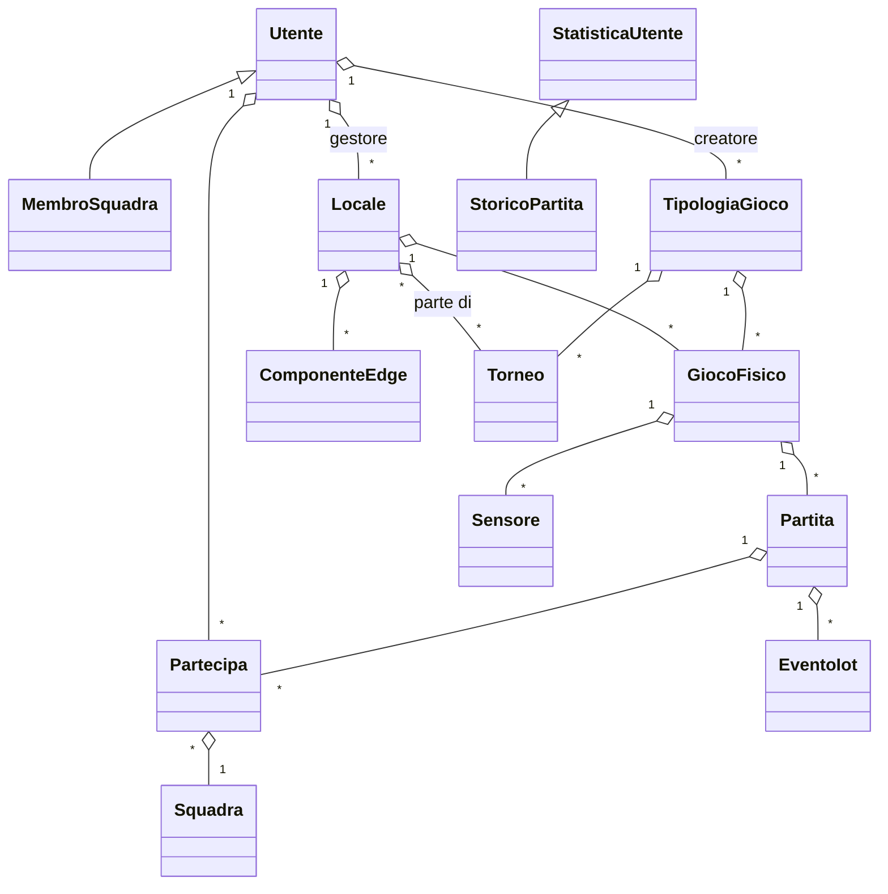
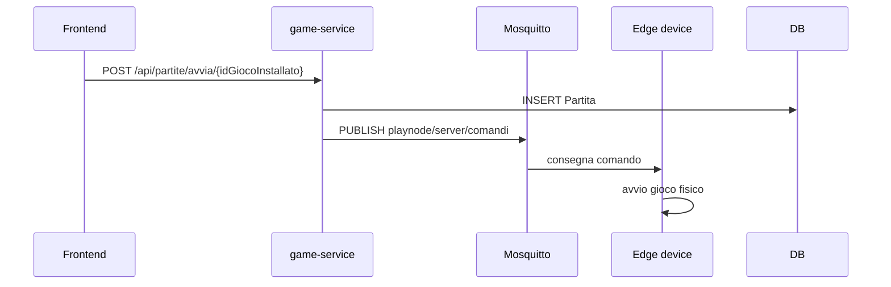
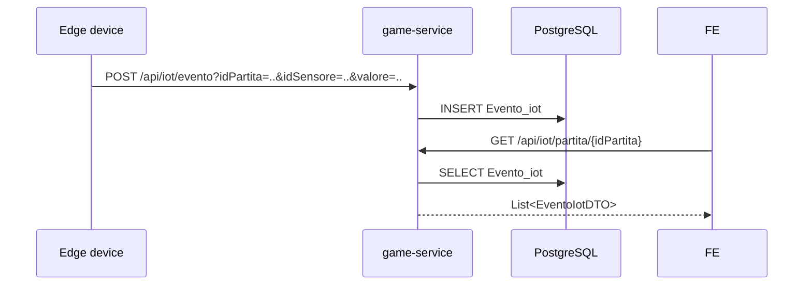
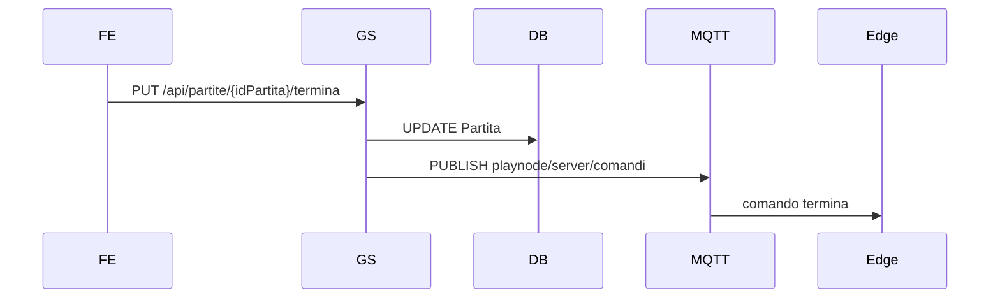
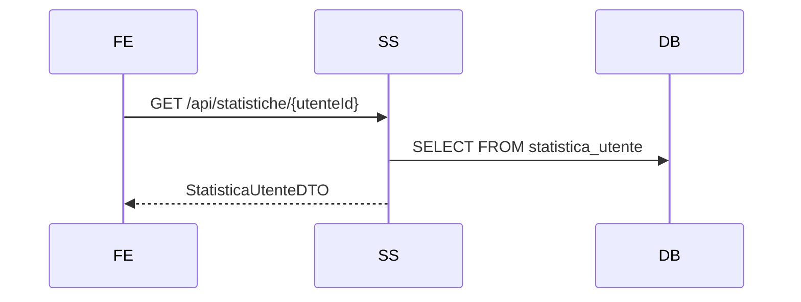

# PlayNode — Project Context

## 1. Executive Summary

PlayNode è una piattaforma distribuita per la gestione di giochi fisici connessi a Internet, pensata per locali e centri ricreativi. Il progetto combina microservizi backend, un frontend web statico, un database centralizzato PostgreSQL, un broker MQTT e componenti Edge per interfacciarsi con sensori e attuatori.

### Obiettivo dell'applicazione

Consentire la gestione e il monitoraggio di locali, giochi, sensori, partite, tornei e statistiche in tempo reale. Il sistema supporta l'autenticazione degli utenti, la contabilizzazione dei punti, la visualizzazione delle statistiche e l'integrazione con dispositivi IoT.

### Problema risolto

Fornisce un'infrastruttura unica per: 
- registrare e autenticare utenti;
- gestire locali e giochi fisici collegati;
- avviare, monitorare e terminare partite;
- raccogliere eventi IoT da sensori fisici o simulatori;
- aggregare statistiche e storico partite;
- orchestrare tornei e partite competitive.

### Principali casi d'uso

- Un amministratore locale o di piattaforma registra e gestisce locali, giochi e tornei.
- Un operatore avvia una partita su un gioco installato e il sistema invia comandi MQTT all'Edge.
- Un dispositivo Edge invia eventi sensore e punti al backend.
- Un giocatore visualizza le proprie statistiche e lo storico delle partite.
- Un servizio di statistiche legge le view SQL aggregate per creare report.

### Utenti coinvolti

- Giocatore
- Gestore locale
- Admin gioco
- Admin piattaforma
- Edge operator / IoT device

### Funzionalità chiave

- Autenticazione JWT e gestione utenti
- CRUD locale, giochi, sensori
- Avvio e terminazione partite
- Integrazione MQTT per Edge e broker
- Aggregazione statistiche utente e storico partite tramite view SQL
- Supporto concettuale per sincronizzazione offline

## 2. Architettura Generale

PlayNode è strutturato come un sistema a microservizi Java Spring Boot, con un frontend statico e componenti Edge. Il backend si appoggia a PostgreSQL e comunica anche via MQTT con i dispositivi locali.

### Panorama architetturale

- Frontend web statico (`frontend/`) interagisce con i microservizi REST.
- `auth-service`: serve login, registrazione e gestione utenti.
- `game-service`: gestisce locali, giochi, partite, sensori, eventi IoT e monitor.
- `stats-service`: fornisce statistiche e storico partite; include un listener MQTT.
- `tournament-service`: gestisce tornei e la loro configurazione.
- `docker/`: contiene Docker Compose, Postgres e Mosquitto.
- `edge-component/` + `iot-devices/`: script Python di Edge / simulatori per generare e inviare eventi MQTT/REST.
- `test-scripts/`: script Python di test End-to-End e utilità di simulazione partite, consolidati e raggruppati qui per mantenere pulita la root.

### Pattern architetturali utilizzati

- Microservizi indipendenti con Spring Boot
- Database centralizzato PostgreSQL condiviso tra i microservizi
- Comunicazione REST per tutte le API pubbliche
- Event-driven con MQTT per comandi locali e ricezione dei dati dai sensori
- View SQL per statistiche/ storico (materializzazione logica)
- Frontend SPA leggera basata su HTML/CSS/JS senza framework di compilazione

### Schema dei microservizi

```mermaid
flowchart LR
    Frontend[Frontend statico]
    Frontend --> AuthService[auth-service\n(8081)]
    Frontend --> GameService[game-service\n(8080)]
    Frontend --> StatsService[stats-service\n(8082)]
    Frontend --> TournamentService[tournament-service\n(8083)]
    AuthService -->|DB| Postgres[(PostgreSQL)]
    GameService -->|DB| Postgres
    StatsService -->|DB| Postgres
    TournamentService -->|DB| Postgres
    GameService -->|MQTT publish| Mosquitto[(MQTT broker)]
    StatsService -->|MQTT subscribe| Mosquitto
    EdgeClient[Edge / Simulatori] -->|MQTT/REST| Mosquitto
    EdgeClient -->|REST| GameService
```

### Dipendenze tra servizi

- Tutti i backend dipendono da PostgreSQL per persistenza.
- `game-service` dipende da Mosquitto per inviare comandi Edge via MQTT.
- `stats-service` dipende da Mosquitto per ascoltare eventi `locale/#`.
- Il frontend dipende direttamente dai servizi REST di auth, game, stats e tournament.

### Flussi principali

- Login/register → auth-service
- Creazione locale/giochi/tornei → game-service / tournament-service
- Avvio partita → game-service → MQTT → Edge
- Evento sensore → Edge / simulatori → REST / MQTT
- Calcolo statistiche → stats-service legge view SQL
- Monitoraggio live → game-service

## 3. Struttura del Repository

| Path | Responsabilità | Tecnologia |
|---|---|---|
| `/backend/auth-service` | Servizio autenticazione, JWT, gestione utenti | Java Spring Boot, PostgreSQL, Spring Security, JJWT |
| `/backend/game-service` | Servizio core giochi, locali, partite, sensori, monitor | Java Spring Boot, PostgreSQL, MQTT (Paho) |
| `/backend/stats-service` | Servizio statistiche, storico partite, listener MQTT | Java Spring Boot, PostgreSQL, MQTT (Paho) |
| `/backend/tournament-service` | Gestione del ciclo di vita tornei | Java Spring Boot, PostgreSQL |
| `/frontend` | Interfaccia utente web, routing client-side | HTML, CSS, JavaScript puro |
| `/docker` | Orchestrazione infrastruttura locale | Docker Compose, Postgres, Mosquitto |
| `/edge-component/mqtt-client/edge-workers` | Bridge Edge per giochi fisici | Python, paho-mqtt, REST API |
| `/iot-devices/python-simulators` | Simulatori e code di visione AI | Python, YOLO, OpenCV |
| `/docker/postgres` | Script SQL di creazione e popolamento DB | PostgreSQL DDL/DML |


## 4. Microservizi

### auth-service

- Responsabilità: autenticazione utente, registrazione, logout, gestione utenti.
- Stack tecnologico: Spring Boot 3.2.5, Spring Web, Spring Data JPA, Spring Security, PostgreSQL, JJWT, SpringDoc OpenAPI.
- Entry point: `backend/auth-service/src/main/java/com/playnode/auth_service/AuthServiceApplication.java`.
- Porte: 8081.
- Database: PostgreSQL `Utente`.
- Configurazioni: `backend/auth-service/src/main/resources/application.properties`.
- Comunicazioni esterne: PostgreSQL, no MQTT.
- Eventi pubblicati/sottoscritti: nessuno.
- API esposte:
  - `POST /api/auth/register` -> registra utente e genera token JWT
  - `POST /api/auth/login` -> login e token JWT
  - `POST /api/auth/logout` -> blacklist token
  - `GET /api/utenti` -> recupera utenti
  - `GET /api/utenti/{id}` -> recupera utente
  - `POST /api/utenti` -> crea utente
  - `PUT /api/utenti/{id}` -> aggiorna utente
  - `DELETE /api/utenti/{id}` -> elimina utente
- Possibili criticità:
  - `SecurityConfig` autentica JWT ma non applica controlli di ruolo nei controller.
  - la blacklist è in-memory, quindi non funziona attraverso riavvii e non scala.

### game-service

- Responsabilità: gestione locali, giochi fisici, sensori, partite, eventi IoT, monitor.
- Stack tecnologico: Spring Boot 3.2.5, Spring Web, Spring Data JPA, PostgreSQL, Eclipse Paho MQTT, SpringDoc OpenAPI.
- Entry point: `backend/game-service/src/main/java/com/playnode/game_service/GameServiceApplication.java`.
- Porte: 8080.
- Database: tabelle `Locale`, `Gioco_fisico`, `Partita`, `Partecipa`, `Evento_iot`, `Sensore`, `Tipologia_gioco`.
- Configurazioni: `backend/game-service/src/main/resources/application.properties`.
- Comunicazioni esterne: PostgreSQL, Mosquitto MQTT.
- Eventi pubblicati:
  - `playnode/server/comandi`: payload JSON per avviare partita e terminare partita.
- API esposte:
  - `GET /api/locali`
  - `GET /api/locali/{idLocale}`
  - `GET /api/locali/{idLocale}/giochi`
  - `POST /api/locali`
  - `PUT /api/locali/{idLocale}`
  - `DELETE /api/locali/{idLocale}`
  - `GET /api/locali/{idLocale}/host_broker`
  - `GET /api/tipologie-gioco`
  - `POST /api/tipologie-gioco`
  - `GET /api/partite`
  - `GET /api/partite/locale/{idLocale}`
  - `POST /api/partite/avvia/{idGiocoInstallato}`
  - `PUT /api/partite/{idPartita}/punteggio?idSquadra=...`
  - `PUT /api/partite/{idPartita}/termina`
  - `POST /api/iot/evento?idPartita=&idSensore=&valore=` 
  - `GET /api/iot/partita/{idPartita}`
  - `POST /api/sensori`
  - `GET /api/sensori/gioco/{giocoFisicoId}`
  - `GET /api/sensori/tipologia/{tipologiaId}`
  - `GET /api/monitor/summary`
  - `GET /api/monitor/latencies`
  - `GET /api/monitor/logs`
- Possibili criticità:
  - `PartitaService` manda comandi MQTT ma non gestisce errori transazionali con il DB.
  - Query native `trovaPartiteLiveGrezzePerLocale` è complessa e potrebbe essere fragile.
  - `statoSync` è modellato, ma non c'è logica offline completa.

### stats-service

- Responsabilità: esporta statistiche utente e storico partite; ascolta eventi MQTT.
- Stack tecnologico: Spring Boot 3.2.5, Spring Web, Spring Data JPA, PostgreSQL, Eclipse Paho MQTT, SpringDoc OpenAPI.
- Entry point: `backend/stats-service/src/main/java/com/playnode/stats_service/StatsServiceApplication.java`.
- Porte: 8082.
- Database: view SQL `statistica_utente`, `storico_partita` basate su tabelle condivise.
- Configurazioni: `backend/stats-service/src/main/resources/application.properties`.
- Comunicazioni esterne: PostgreSQL, Mosquitto MQTT.
- Eventi sottoscritti:
  - `locale/#` via `MqttListenerService`.
- API esposte:
  - `GET /api/statistiche/{utenteId}`
  - `GET /api/storico/utente/{utenteId}`
- Possibili criticità:
  - `MqttListenerService` registra solo log, non trasforma messaggi MQTT in oggetti persistenti.
  - la view `statistica_utente` dipende dalle tabelle condivise; non c'è una logica di resilienza se il DB cambia.

### tournament-service

- Responsabilità: CRUD tornei.
- Stack tecnologico: Spring Boot 3.2.5, Spring Web, Spring Data JPA, PostgreSQL, SpringDoc OpenAPI.
- Entry point: `backend/tournament-service/src/main/java/com/playnode/tournament_service/TournamentServiceApplication.java`.
- Porte: 8083.
- Database: tabella `Torneo` e relazione `Torneo_locale`.
- Configurazioni: `backend/tournament-service/src/main/resources/application.properties`.
- Comunicazioni esterne: PostgreSQL.
- API esposte:
  - `GET /api/tornei`
  - `POST /api/tornei`
  - `GET /api/tornei/{id}`
  - `PUT /api/tornei/{id}`
  - `DELETE /api/tornei/{id}`
- Possibili criticità:
  - `application.properties` contiene un typo su `spring.application.name` (`pring.application.name`).

## 5. Dominio Applicativo

### Entità principali

| Entità | Descrizione | Relazioni |
|---|---|---|
| Utente | Account utente con ruolo e genere | 1:N con `Locale` (gestore), 1:N con `Partecipa`, 1:N con `Tipologia_gioco` (creatore), 1:N con `Membro_squadra` |
| Locale | Negozio / ambiente fisico | 1:N con `Gioco_fisico`, 1:N con `Componente_edge`, N:M con `Torneo` |
| GiocoFisico | Installazione fisica di un gioco | N:1 con `Locale`, N:1 con `Tipologia_gioco`, 1:N con `Partita`, 1:N con `Sensore` |
| TipologiaGioco | Definizione del gioco e regole | 1:N con `Gioco_fisico`, 1:N con `Torneo` |
| Partita | Esecuzione di gioco | N:1 con `Gioco_fisico`, N:1 con `Torneo`, 1:N con `Partecipa`, 1:N con `EventoIot` |
| Partecipa | Punteggio per giocatore o squadra | N:1 con `Partita`, N:1 con `Utente`, N:1 con `Squadra` |
| Sensore | Sensore collegato a un gioco fisico | N:1 con `Gioco_fisico` |
| EventoIot | Evento segnale da sensore | N:1 con `Partita`, N:1 con `Sensore` |
| Torneo | Gara organizzata | 1:N con `Partita`, N:M con `Locale` |
| StatisticaUtente | Vista aggregata statistiche utente | read-only da view SQL |
| StoricoPartita | Vista storica partite utente | read-only da view SQL |

### Diagramma del dominio



## 6. Modello Dati

### auth-service / Utente

- `id_utente`: serial PK
- `username`: varchar(50), not null, unique
- `email`: varchar(100), not null, unique
- `password`: varchar, not null
- `ruolo`: enum `ruolo_tipo` (`Giocatore`, `Gestore`, `AdminGioco`, `AdminPiattaforma`)
- `sesso`: enum `sesso_tipo` (`Maschio`, `Femmina`, `Altro`)
- `oauth_provider`: varchar(50)

Fonte: `docker/postgres/init.sql`, `backend/auth-service/src/main/java/com/playnode/auth_service/entity/Utente.java`

### game-service / Locale

- `id_locale`: serial PK
- `nome`: varchar(100) not null
- `indirizzo`: varchar(255) not null
- `accesso`: enum `accesso_tipo` (`Luogo pubblico`, `Luogo privato`)
- `host_broker`: varchar
- `gestore_id`: FK `Utente.id_utente`

Fonte: `docker/postgres/init.sql`, `backend/game-service/src/main/java/com/playnode/game_service/entity/Locale.java`

### game-service / Tipologia_gioco

- `id_tipologia_gioco`: serial PK
- `nome_tipologia_gioco`: varchar(100)
- `descrizione`: varchar(250)
- `regole`: varchar(300)
- `admin_creatore_id`: FK `Utente.id_utente`

Fonte: `docker/postgres/init.sql`, `backend/game-service/src/main/java/com/playnode/game_service/entity/TipologiaGioco.java`

### game-service / Gioco_fisico

- `id_gioco_fisico`: serial PK
- `tipologia_gioco_id`: FK `Tipologia_gioco.id_tipologia_gioco`
- `locale_id`: FK `Locale.id_locale`
- `edge_id`: FK `Componente_edge.id_componente_edge`

Fonte: `docker/postgres/init.sql`, `backend/game-service/src/main/java/com/playnode/game_service/entity/GiocoFisico.java`

### game-service / Sensore

- `id_sensore`: serial PK
- `gioco_fisico_id`: FK `Gioco_fisico.id_gioco_fisico`
- `tipo`: varchar(50)
- `posizione`: varchar(100)

Fonte: `docker/postgres/init.sql`, `backend/game-service/src/main/java/com/playnode/game_service/entity/Sensore.java`

### game-service / Partita

- `id_partita`: serial PK
- `gioco_fisico_id`: FK `Gioco_fisico.id_gioco_fisico`
- `torneo_id`: FK `Torneo.id_torneo`
- `timestamp_inizio`: timestamp not null
- `timestamp_fine`: timestamp nullable
- `stato_sync`: enum `stato_sync_tipo` (`Realtime`, `Sincronizzata_Offline`)

Fonte: `docker/postgres/init.sql`, `backend/game-service/src/main/java/com/playnode/game_service/entity/Partita.java`

### game-service / Partecipa

- `id_partecipa`: serial PK
- `partita_id`: FK `Partita.id_partita`
- `giocatore_id`: FK `Utente.id_utente`
- `squadra_id`: FK `Squadra.id_squadra`
- `punteggio_finale`: int default 0
- `vittoria`: boolean default false

Fonte: `docker/postgres/init.sql`, `backend/game-service/src/main/java/com/playnode/game_service/entity/Partecipa.java`

### game-service / Evento_iot

- `id_evento`: serial PK
- `partita_id`: FK `Partita.id_partita`
- `sensore_id`: FK `Sensore.id_sensore`
- `timestamp_evento`: timestamp not null
- `valore`: varchar(50) not null

Fonte: `docker/postgres/init.sql`, `backend/game-service/src/main/java/com/playnode/game_service/entity/EventoIot.java`

### tournament-service / Torneo

- `id_torneo`: serial PK
- `nome_torneo`: varchar(100) not null
- `modalita`: enum `modalita_gioco_tipo` (`Individuale`, `Squadre`)
- `regole_del_torneo`: varchar(300) not null
- `classifica`: varchar(500)
- `tipologia_gioco_id`: FK `Tipologia_gioco.id_tipologia_gioco`
- `data_inizio`: Date
- `data_fine`: Date
- `torneo_locale`: relazione N:M con `Locale`

Fonte: `docker/postgres/init.sql`, `backend/tournament-service/src/main/java/com/playnode/tournament_service/entity/Torneo.java`

### Statistiche persistenti/read-only

- `statistica_utente`: vista SQL aggregata su `Partecipa` e `Partita`
- `storico_partita`: vista SQL storica per utente su `Partecipa` e `Partita`

Fonte: `docker/postgres/init.sql`, `backend/stats-service/src/main/java/com/playnode/stats_service/entity/StatisticaUtente.java`, `backend/stats-service/src/main/java/com/playnode/stats_service/entity/StoricoPartita.java`

## 7. API REST

### auth-service

| Metodo | Path | Input | Output | Autorizzazione | Servizio |
|---|---|---|---|---|---|
| POST | /api/auth/register | `RegisterRequest {username,email,password,ruolo,sesso}` | `AuthResponse {message,success,userId,username,email,ruolo,token}` | pubblico | auth-service |
| POST | /api/auth/login | `LoginRequest {email,password}` | `AuthResponse` | pubblico | auth-service |
| POST | /api/auth/logout | auth header Bearer | `{success,message,timestamp}` | pubblico | auth-service |
| GET | /api/utenti | - | `List<UtenteDTO>` | JWT | auth-service |
| GET | /api/utenti/{id} | - | `UtenteDTO` | JWT | auth-service |
| POST | /api/utenti | `UtenteRequest` | `UtenteDTO` | JWT | auth-service |
| PUT | /api/utenti/{id} | `UtenteRequest` | `UtenteDTO` | JWT | auth-service |
| DELETE | /api/utenti/{id} | - | `204` / `404` | JWT | auth-service |

### game-service

| Metodo | Path | Input | Output | Autorizzazione | Servizio |
|---|---|---|---|---|---|
| GET | /api/locali | - | `List<LocaleDTO>` | JWT | game-service |
| GET | /api/locali/{idLocale}/giochi | - | `List<GiocoInstallatoDTO>` | JWT | game-service |
| POST | /api/locali | `LocaleDTO` | `LocaleDTO` | JWT | game-service |
| PUT | /api/locali/{idLocale} | `LocaleDTO` | `LocaleDTO` | JWT | game-service |
| DELETE | /api/locali/{idLocale} | - | `204` / `404` | JWT | game-service |
| GET | /api/locali/{idLocale}/host_broker | - | `String` | JWT | game-service |
| GET | /api/tipologie-gioco | - | `List<TipologiaGiocoDTO>` | JWT | game-service |
| POST | /api/tipologie-gioco | `TipologiaGioco` | `TipologiaGioco` | JWT | game-service |
| GET | /api/partite | - | `List<PartitaDTO>` | JWT | game-service |
| GET | /api/partite/locale/{idLocale} | - | `List<PartitaDTO>` | JWT | game-service |
| POST | /api/partite/avvia/{idGiocoInstallato} | - | `PartitaDTO` | JWT | game-service |
| PUT | /api/partite/{idPartita}/punteggio | query `idSquadra` | `PartitaDTO` | JWT | game-service |
| PUT | /api/partite/{idPartita}/termina | - | `PartitaDTO` | JWT | game-service |
| POST | /api/iot/evento | query `idPartita,idSensore,valore` | `EventoIotDTO` | JWT | game-service |
| GET | /api/iot/partita/{idPartita} | - | `List<EventoIotDTO>` | JWT | game-service |
| POST | /api/sensori | `SensoreDTO` | `201` | JWT | game-service |
| GET | /api/sensori/gioco/{giocoFisicoId} | - | `List<SensoreDTO>` | JWT | game-service |
| GET | /api/sensori/tipologia/{tipologiaId} | - | `List<SensoreDTO>` | JWT | game-service |
| GET | /api/monitor/summary | - | `Map<String,Object>` | JWT | game-service |
| GET | /api/monitor/latencies | - | `List<Map<String,Object>>` | JWT | game-service |
| GET | /api/monitor/logs | - | `List<Map<String,String>>` | JWT | game-service |

### stats-service

| Metodo | Path | Input | Output | Autorizzazione | Servizio |
|---|---|---|---|---|---|
| GET | /api/statistiche/{utenteId} | - | `StatisticaUtenteDTO` | JWT | stats-service |
| GET | /api/storico/utente/{utenteId} | - | `List<StoricoPartitaDTO>` | JWT | stats-service |

### tournament-service

| Metodo | Path | Input | Output | Autorizzazione | Servizio |
|---|---|---|---|---|---|
| GET | /api/tornei | - | `List<TorneoDTO>` | JWT | tournament-service |
| POST | /api/tornei | `TorneoDTO` | `TorneoDTO` | JWT | tournament-service |
| GET | /api/tornei/{id} | - | `TorneoDTO` | JWT | tournament-service |
| PUT | /api/tornei/{id} | `TorneoDTO` | `TorneoDTO` | JWT | tournament-service |
| DELETE | /api/tornei/{id} | - | `204` / `404` | JWT | tournament-service |

### Esempi JSON

#### Login

```json
{
  "email": "angie.albitres@gmail.com",
  "password": "PlayNode2026!"
}
```

#### Register

```json
{
  "username": "angie_player",
  "email": "angie.albitres@gmail.com",
  "password": "PlayNode2026!",
  "ruolo": "Giocatore",
  "sesso": "Femmina"
}
```

#### Avvia partita

```http
POST /api/partite/avvia/1
Authorization: Bearer <token>
```

#### Registra sensore

```json
POST /api/sensori
{
  "idGiocoFisico": 1,
  "tipo": "HC-SR04 Ultrasuoni",
  "posizione": "Porta Squadra 1"
}
```

## 8. MQTT/Event Driven Architecture

### Broker utilizzato

- `Eclipse Mosquitto` avviato via `docker/docker-compose.yml` come servizio `mosquitto`.
- Porte: 1883 (MQTT) e 9001 (WebSocket MQTT).

### Topic principali

| Topic | Publisher | Subscriber | Payload |
|---|---|---|---|
| `edge/gioco/{id}/comandi` | `game-service` | Edge bridge Python | `{"nuova_partita_id":...}` o `{"termina_partita": true}` in JSON |
| `calcetto/tavolo1/goal` | Arduino / Edge bridge | Edge bridge calcetto | `A` / `B` (squadra) |
| `calcetto/tavolo1/distA|distB` | Arduino / Edge bridge | Edge bridge calcetto | distanza numerica come stringa |
| `bocce/punteggio` | telecamera / simulatore bocce | Edge bridge bocce | JSON contenente `squadra_vincitrice`, `punti` |
| `locale/#` | Qualsiasi Edge / publisher locale | `stats-service` | generic JSON di evento, in particolare `/match_end` |

### Payload tipici

- Comando avvio partita: `{"idGiocoFisico": 1, "idPartita": 123}`
- Comando termine partita: `{"termina_partita": true}`
- Goal calcetto: `A` oppure `B`
- Distanze sensore: valore numerico in stringa
- Bocce simulator: `{"gioco": "bocce", "squadra_vincitrice": "BLU", "punti": 2}`

### QoS e flussi evento

- `game-service` imposta QoS `1` sui messaggi MQTT quando pubblica.
- Gli edge worker Python usano Paho MQTT con `client.loop_forever()`.
- Il `stats-service` usa `MqttClient.subscribe(topicName)` per ascoltare eventi e loggarli.
- Il flusso tipico è: `Frontend -> game-service -> MQTT -> Edge -> REST -> game-service`.

## 9. Sicurezza

### Autenticazione

- JWT Bearer token generati da `auth-service`.
- `AuthController` espone `POST /api/auth/login` e `POST /api/auth/register`.
- `JwtService` crea e valida i token con la secret `jwt.secret` da `application.properties`.
- `JwtAuthenticationFilter` verifica il token e popola `SecurityContextHolder`.
- Logout aggiunge il token alla blacklist in-memory (`TokenBlacklistService`).

### Autorizzazione

- `SecurityConfig` in ogni microservizio richiede JWT valido (eccetto endpoint pubblici documentati).
- `@PreAuthorize` su controller: ruoli (`hasRole`, `hasAnyRole`) e ownership (`#id.toString() == authentication.principal`, `@localeSecurity.isGestoreOfLocale(...)`).
- Ruoli nel token JWT (prefisso `ROLE_` nel filter): `GIOCATORE`, `GESTORE`, `ADMINGIOCO`, `ADMINPIATTAFORMA`.
- Principal JWT = `userId` come stringa (per match con path variable).
- Endpoint pubblici (senza JWT): `POST /api/auth/**`, Swagger, `POST /api/iot/evento`, `PUT /api/partite/*/punteggio` (bridge Edge).
- `LocaleAuthorizationService` (game-service): verifica che il gestore sia owner del locale.

### Middleware / security filter

- `JwtAuthenticationFilter` valida token e blacklist.
- `SecurityConfig` configura CORS centralizzato leggendo i domini consentiti in application.properties e disabilita CSRF. Non utilizzare `@CrossOrigin` nei controller né classi `GlobalCorsConfig` addizionali per evitare conflitti (risolto issue di CORS preflight errato).
- Brute force protection lato login è implementata in-memory con un limite di 5 tentativi per IP e blocco di 15 minuti.

### Vulnerabilità potenziali

- Blacklist JWT volatile e non persistente (logout non sopravvive al riavvio).
- Il token JWT viene salvato in `localStorage` nel frontend (esposto a XSS se il sito non è protetto).

## 10. Configurazione e Deploy

### Docker

Il file principale è `docker/docker-compose.yml`.

Servizi:
- `postgres`: `postgres:15`, espone `5435:5432`, monta `init.sql` e `populate.sql`.
- `web-server`: `nginx:alpine`, serve `frontend` su `63342:80`.
- `auth-service`: build da `backend/auth-service`, porta `8081`.
- `game-service`: build da `backend/game-service`, porta `8080`.
- `stats-service`: build da `backend/stats-service`, porta `8082`.
- `tournament-service`: build da `backend/tournament-service`, porta `8083`.
- `mosquitto`: `eclipse-mosquitto:latest`, espone `${MQTT_PORT:-1883}:1883` e `${MQTT_WS_PORT:-9001}:9001`.

### Environment variables

`docker/.env.example` definisce le variabili principali:

| Variabile | Descrizione | Default |
|---|---|---|
| DB_NAME | Nome database PostgreSQL | `playnode_db` |
| DB_USER | Utente DB | `playnode_admin` |
| DB_PASSWORD | Password DB | `inserisci_qui_la_tua_password_locale` |
| DB_HOST | Host DB | `playnode_postgres` |
| DB_PORT | Porta DB | `5432` |
| MQTT_PORT | Porta MQTT | `1883` |
| MQTT_WS_PORT | Porta MQTT WebSocket | `9001` |
| MQTT_USER | Username MQTT | `inserisci_qui_il_tuo_username_mqtt` |
| MQTT_PASSWORD | Password MQTT | `inserisci_qui_la_tua_password_mqtt` |
| JWT_SECRET | Secret per JWT | `inserisci_qui_la_tua_chiave_segreta_lunghissima` |
| JWT_EXPIRATION | Durata JWT in ms | `3600000` |
| CORS_ALLOWED_ORIGINS | Origini consentite | `http://localhost:3000,http://localhost:8080,http://localhost:63342,http://localhost:5173,http://localhost:4200,http://127.0.0.1:5500` |

### Configurazioni runtime chiave

- Ogni servizio usa `spring.datasource.url` per collegarsi al DB.
- `game-service` usa `mqtt.client.id`, `mqtt.username`, `mqtt.password`.
- `stats-service` usa `mqtt.broker.url`, `mqtt.client.id`, `mqtt.topic`.
- `auth-service` usa `jwt.secret` e `jwt.expiration`.

### Note di deploy

- I servizi Spring Boot sono containerizzati con `Dockerfile` in ogni cartella backend.
- Il frontend statico viene servito da un container Nginx.
- `docker-compose` crea un volume `playnode_db_data` per la persistenza del DB.

## 11. Frontend

### Framework

- Non è presente un framework SPA moderno.
- Il frontend è statico e costruito con HTML, CSS e JavaScript puro.
- Le viste sono in `frontend/views/*.js`.
- La logica di routing è manuale e basata su eventi custom `cgp:goto` in `frontend/js/app.js`.

### Routing e pagine

- `frontend/index.html`: punto di ingresso.
- `frontend/js/app.js`: router client-side, autenticazione e memorizzazione del token.
- `frontend/views/login.js`: pagina login.
- `frontend/views/register.js`: registrazione.
- `frontend/views/dashboard.js`: dashboard principale.
- `frontend/views/player.js`, `admin-game.js`, `admin-platform.js`, `locale.js`: pagine specifiche per ruolo.

### Gestione stato

- Stato minimale basato su `localStorage`.
- Token JWT memorizzato in `localStorage.token`.
- `userId` e `userRole` memorizzati in `localStorage`.

### Autenticazione frontend

- `frontend/js/api.js` include `fetchWithAuth()` che aggiunge header `Authorization: Bearer <token>`.
- In caso di 401/403 il frontend cancella il token e manda un evento `cgp:goto` verso `login`.

### API consumate

- `api.js` chiama tutti i servizi REST principali: auth, utenti, locali, partite, tornei, statistiche, sensori, monitor.
- La UI chiama anche `getEventiPartita(idPartita)` per mostrare i dati IoT.

## 12. Edge/Sensori

### Struttura Edge

- `edge-component/mqtt-client/edge-workers/edgebridge_calcetto.py`
- `edge-component/mqtt-client/edge-workers/edgebridge_bocce.py`

Questi script Python sono bridge tra un broker MQTT locale e il backend REST.

### Protocolli

- MQTT per ricevuta comandi e lettura sensori locali.
- REST per scrivere i punti su `game-service`.

### Logica

- `edgebridge_calcetto.py` si iscrive a topic locali `calcetto/tavolo1/*` e `edge/gioco/{id}/comandi`.
- Quando riceve un goal, chiama `PUT /api/partite/{idPartita}/punteggio?idSquadra=...`.
- Quando riceve un comando di avvio, resetta il dispositivo Arduino.
- `edgebridge_bocce.py` si iscrive a `bocce/punteggio` e comandi di gioco.
- `iot-devices/python-simulators/BocceCode.py` usa YOLO/OpenCV per identificare bocce e pubblicare risultati MQTT.

### Offline e sincronizzazione

- Il database contiene un campo `stato_sync` nella tabella `Partita` (`Realtime` / `Sincronizzata_Offline`).
- Nel codice del progetto non è presente una logica completa di sincronizzazione offline.
- La presenza del campo indica un requisito non totalmente implementato.

## 13. Flussi End-to-End

### Avvio partita

1. L'utente richiede `POST /api/partite/avvia/{idGiocoInstallato}`.
2. `PartitaService.avviaNuovaPartita()` crea `Partita` e salva il record.
3. `MqttPublisherService.inviaComandoAvvioPartita()` pubblica su `playnode/server/comandi`.
4. L'Edge locale riceve il comando e resetta / inizia il gioco.



### Registrazione evento sensore

1. L'Edge riceve un evento hardware locale.
2. L'Edge invia una richiesta REST a `POST /api/iot/evento` con `idPartita`, `idSensore`, `valore`.
3. `EventoIotService.registraEvento()` salva l'evento in `Evento_iot`.
4. La UI può richiamare `GET /api/iot/partita/{idPartita}` per mostrare gli eventi.



### Fine partita

1. L'utente chiama `PUT /api/partite/{idPartita}/termina`.
2. `PartitaService.terminaPartita()` imposta `timestampFine`.
3. `MqttPublisherService.inviaComandoTerminaPartita()` pubblica su `playnode/server/comandi`.
4. Edge locale arresta la partita.



### Calcolo statistiche

1. `GET /api/statistiche/{utenteId}` richiama `StatisticaService.ottieniStatistichePerUtente()`.
2. Il servizio legge la view `statistica_utente`.
3. Restituisce un DTO anche se l'utente non ha record (zerato).



### Sincronizzazione offline

- Modello presente in DB con `stato_sync_tipo`.
- Non esiste codice applicativo che sincronizzi eventi offline in `game-service`.
- Se è un requisito, va implementata una pipeline di sincronizzazione e retry dei dati da Edge.

## 14. Concorrenza e Threading

### Punti di concorrenza

- Spring Boot gestisce thread servlet per le richieste HTTP.
- `MqttPublisherService` mantiene `Map<String, MqttClient>` concurrent per connessioni broker.
- `BruteForceProtection` usa `ConcurrentHashMap` e `ReentrantReadWriteLock`.
- `MqttListenerService` usa callback MQTT asincroni con `MqttClient`.

### Scheduler / task asincroni

- Non sono presenti scheduler Spring (`@Scheduled`) nel codice esaminato.
- Il listener MQTT è avviato in `@PostConstruct` e gira in background.

### Listener / code

- `MqttListenerService`: listener MQTT in stats-service.
- `JwtAuthenticationFilter`: filtro per tutte le richieste non pubbliche.

## 15. Testing

Questa guida illustra passo-passo come testare tutte le componenti del sistema PlayNode: il backend (servizi), l'integrazione MQTT (Mosquitto), le componenti Edge (simulazioni IoT) e l'end-to-end delle partite live.

### Test Unitari del Backend (Java)

I microservizi backend possiedono test unitari e di integrazione scritti in Java (con JUnit e Mockito) posizionati canonicamente in `src/test/java/...`.

**Come eseguire i test Java:**
Per testare i singoli servizi, posizionati nella cartella root del backend ed esegui i test tramite Maven.

**Per il `game-service`** (che copre la logica delle partite live e l'invio MQTT):
```bash
cd backend/game-service
./mvnw test
```

**Per lo `stats-service`** (che copre la ricezione degli eventi MQTT):
```bash
cd backend/stats-service
./mvnw test
```

Questi test verificheranno automaticamente che il salvataggio dei punteggi, le transizioni di stato delle partite e i mock del broker MQTT funzionino come previsto senza richiedere il database o Mosquitto accesi.

### Test delle Componenti Edge (Python)

I componenti Edge che fanno da bridge tra l'hardware fisico e il backend MQTT hanno ora i loro test unitari dedicati in `edge-component/test`.

**Come eseguire i test Edge:**
Assicurati di avere Python installato. Puoi eseguire i test usando il framework `unittest` integrato in Python. 

**Per il calcetto:**
```bash
python -m unittest edge-component/test/test_edgebridge_calcetto.py
```

**Per le bocce:**
```bash
python -m unittest edge-component/test/test_edgebridge_bocce.py
```

Questi test simulano l'invio e la ricezione di payload MQTT e intercettano le chiamate `requests.put` al backend per convalidarne l'esattezza (Mocking).

### Test End-to-End (Simulatori E2E)

I vecchi file presenti nella root (`test-scripts`) sono stati smistati nelle cartelle `test` dedicate per ciascun modulo, poiché fungono da veri e propri collaudi End-to-End (E2E) richiedendo il sistema avviato.

**Prerequisiti per i simulatori:**
Prima di eseguire questi test E2E, assicurati che tutta l'infrastruttura sia accesa:
```bash
cd docker
docker-compose up -d
```

**A. Testare le chiamate API del Game Service**
Il servizio `game-service` ha degli script E2E in `backend/game-service/test/`.
Questi script testano le API REST direttamente, **bypassando** il livello IoT/MQTT. Sono utili per validare il core del backend o la UI del Frontend in isolamento.

1. **`simulate_live_match.py`**: Simula una partita live assegnando punti periodicamente tramite chiamate REST. *(Attenzione: non usa l'Edge Bridge o MQTT!)*
   ```bash
   python backend/game-service/test/simulate_live_match.py
   ```
2. **`test_script.py`**: Fa un run-through completo dell'API creando un utente, un locale, installando un gioco e avvisando una partita, infine inviando un gol.
   ```bash
   python backend/game-service/test/test_script.py
   ```

**B. Testare la Piattaforma Edge & MQTT dal vivo**
Questi script collaudano la connessione diretta a Mosquitto e i Bridge Edge reali.

1. **Test del Publisher MQTT**:
   Per assicurarti che il broker riceva i messaggi di comando:
   ```bash
   python edge-component/test/test_mqtt.py
   ```
2. **Simulatore Bocce Elettroniche**:
   Simula il sistema di Computer Vision (OpenCV) che comunica direttamente via MQTT al broker locale. Questo script ora si trova in `iot-devices/test/`.
   ```bash
   python iot-devices/test/mock_bocce.py
   ```

3. **Flusso Completo IoT (Frontend + Edge + Mock)**:
   Per testare interamente il sistema hardware (Calcetto o Bocce) e vedere i punteggi salire a schermo sul Frontend in tempo reale:
   - **Step 1 (Infrastruttura):** Assicurati che backend (game-service) e broker MQTT siano attivi.
   - **Step 2 (Ponte Edge):** Avvia l'Edge Bridge corrispondente in un terminale separato e lascialo in esecuzione:
     ```bash
     python edge-component/mqtt-client/edge-workers/edgebridge_bocce.py
     # Oppure per il calcetto: python edge-component/mqtt-client/edge-workers/edgebridge_calcetto.py
     ```
   - **Step 3 (Avvio Partita da UI):** Apri il Frontend nel browser, effettua il Login come Gestore, entra nel Locale -> "Partite Live", e clicca "Avvia Partita" sul gioco scelto. Osserva il terminale dell'Edge Bridge: confermerà la ricezione dell'ID della partita appena creata.
   - **Step 4 (Simulazione Punti):** Apri un secondo terminale ed esegui il mock hardware per simulare la rilevazione dei punti:
     ```bash
     python iot-devices/test/mock_bocce.py
     ```
   - L'Edge Bridge catturerà l'evento dal broker locale, inoltrerà la chiamata REST al server, e il Frontend si aggiornerà automaticamente mostrando i punti a schermo!

### Riassunto della nuova alberatura di test

- `backend/game-service/src/test/java/` -> Test unitari/Mock su Partite e Publisher MQTT
- `backend/game-service/test/` -> Script Python per l'End-to-End e la simulazione live
- `backend/stats-service/src/test/java/` -> Test unitari su Listener MQTT e Statistiche
- `edge-component/test/` -> Test unitari `unittest` per Python Edge Workers e test di connettività MQTT
- `iot-devices/test/` -> Mock e simulazioni fisiche dei dispositivi hardware (es. telecamera bocce)

## 16. Technical Debt

### Problemi rilevati

- `SecurityConfig` non applica ruoli in modo selettivo.
- Blacklist JWT è volatile e non persistente.
- `game-service` e `stats-service` includono MQTT ma la sincronizzazione offline non è completata.
- Naming inconsistente tra DB e Java (es. `gioco_fisico_id`, `stato_sync`).
- Frontend usa `localStorage` per il token e non ha protezione XSS dichiarata.
- Non esiste una chiara strategia di deployment multistanza o service discovery.
- Le view SQL sono utili, ma non sono accompagnate da test di regressione o indici specifici.
- Alcune API non usano DTO consistenti; payload di alcune risposte è diretto entità.

### Priorità consigliate

1. Aggiungere autorizzazione basata su ruoli in `auth-service`.
2. Implementare persistenza della blacklist JWT se si vuole supportare logout completo.
3. Correggere `tournament-service` `application.properties`.
4. Aggiungere test unitari/integration per le API core.
5. Definire e implementare una strategia di sincronizzazione offline reale.
6. Convalidare e harden la configurazione MQTT e CORS.

## 17. Guida per Futuri Sviluppi AI

### Convenzioni del progetto

- Ogni microservizio Spring Boot è autonoma e in `backend/<service>`.
- I servizi condividono DB ma mantengono codice separato.
- Il frontend è statico e usa moduli JS per routing e chiamate API.
- I file di configurazione principali sono `application.properties` in ciascun backend.
- `docker/docker-compose.yml` è il punto di partenza per l'intera infrastruttura.

### Pattern da seguire

- Usa DTO nei controller per evitare di esporre direttamente entità JPA.
- Evita `@CrossOrigin(origins = "*")` in produzione.
- Centralizza la gestione degli errori con `@ControllerAdvice` e `ResponseEntity` standard.
- Mantieni le API REST idempotenti quando possibile.
- Usa nomi di variabili coerenti tra DB e codice Java.

### Come aggiungere un nuovo microservizio

1. Creare una cartella in `backend/`.
2. Inizializzare un progetto Spring Boot con dipendenze `spring-boot-starter-web`, `spring-boot-starter-data-jpa`, `postgresql`, `spring-boot-starter-test`.
3. Aggiungere `Dockerfile` simile agli altri servizi.
4. Aggiornare `docker/docker-compose.yml` con il nuovo servizio.
5. Aggiungere configurazioni nel `.env` se necessario.
6. Usare DB condiviso se serve, ma preferire un proprio schema/tabelle se il dominio è separato.

### Come aggiungere un nuovo endpoint

1. Definire il caso d'uso e il payload in un DTO.
2. Aggiungere l'endpoint al controller appropriato.
3. Implementare la logica in un servizio dedicato.
4. Aggiungere repository/entità se occorre persistenza.
5. Scrivere test unitari e/o di integrazione.
6. Aggiornare `frontend/js/api.js` se serve consumare l'endpoint.

### Come aggiungere un nuovo evento MQTT

1. Scegliere topic coerenti con l'architettura esistente.
2. Aggiornare `docker/docker-compose.yml` se serve configurare il broker.
3. Aggiungere publisher in `game-service` o nei bridge Edge.
4. Aggiungere subscriber in `stats-service` o in altri componenti Edge.
5. Documentare il payload e il QoS.
6. Gestire errori di connessione e riconnessione.

### Come aggiungere un nuovo sensore

1. Definire la tabella/entità sensore se necessario.
2. Estendere `SensoreController` e `SensoreRepository` in `game-service`.
3. Aggiornare `LocaleService` / `GiocoInstallatoDTO` se il sensore influisce sulla UI.
4. Aggiungere un edge-bridge o simulatore per il nuovo sensore.
5. Verificare la persistenza in `Evento_iot` e le query di visualizzazione.

### Checklist prima di effettuare modifiche

- [ ] Capire il dominio e le entità coinvolte.
- [ ] Verificare i file `application.properties` e le variabili `.env`.
- [ ] Controllare eventuali dipendenze MQTT e Postgres.
- [ ] Scrivere/aggiornare test prima di distribuire.
- [ ] Aggiornare la documentazione del servizio e il diagramma.
- [ ] Non esporre segreti in chiaro nei file di configurazione.

### File da consultare prima di modificare il sistema

- `docker/docker-compose.yml`
- `docker/postgres/init.sql`
- `docker/postgres/populate.sql`
- `backend/auth-service/src/main/java/...`
- `backend/game-service/src/main/java/...`
- `backend/stats-service/src/main/java/...`
- `backend/tournament-service/src/main/java/...`
- `frontend/js/api.js`
- `frontend/js/app.js`
- `frontend/views/*.js`
- `edge-component/mqtt-client/edge-workers/*.py`

### Best practice obbligatorie

- Mantieni l'API REST separata dal frontend.
- Non usare `*` in `Access-Control-Allow-Origin` in produzione.
- Proteggi il secret JWT e le credenziali MQTT.
- Preferisci DTO in ingresso/uscita e non entità JPA dirette.
- Tratta i messaggi MQTT come eventi idempotenti quando possibile.
- Verifica side effect su DB prima di inviare comandi Edge.
- Usa `spring-boot-starter-test` per creare test di business logic, non solo context load.
- Aggiornare sempre il file PROJECT_CONTEXT.md.

---

## Cronologia Aggiornamenti Recenti

- **Visualizzazione Partite Live (Gestore):** Completata la dashboard "Partite Live" nel Frontend (`locale.js`) che esegue il polling ogni 5s recuperando i punteggi tramite REST API `GET /api/partite/locale/{id}` e aggiorna l'interfaccia.
- **Supporto "Termina Partita" manuale:** Implementato un bottone per forzare la fine di una partita in corso, con popup di conferma Toast nativo e trigger dell'API REST `PUT /api/partite/{id}/termina` che chiude lo stato della partita e manda il comando MQTT all'Edge.
- **Inserimento Gioco Bocce:** Inserito a database il gioco fisico "Bocce Elettroniche" mappandolo sul Locale ID 1.
- **Supporto Multi-Locale e Fallback Gestore:** Completata l'implementazione del flusso di login. Se un gestore possiede più locali, una finestra modale nativa (`window.showLocaleSelectorModal` tramite `.btn-locale-select`) ne forza la scelta prima di proseguire. Implementato lo switch rapido (menu a tendina) nella Topbar (`dashboard.js`). Rimosso l'hardcoding al "Locale ID 1"; qualora un gestore non abbia locali associati, tutte le tab della dashboard visualizzeranno correttamente un *Empty State* pulito ("Nessun locale associato").
- **Implementazione Test Backend (Java):** Completata la suite di test unitari con `JUnit 5` e `Mockito` per `game-service` (`PartitaService`, `MqttPublisherService`), `stats-service` (`MqttListenerService`), e `auth-service` (`JwtService`). Utilizzate asserzioni esplicite come `assertThrows`, `assertNull`, `assertTrue` e disabilitato temporaneamente il load del contesto Spring Boot tramite `@Disabled` per consentire l'esecuzione locale della suite Maven senza la necessità di database Dockerizzati in esecuzione.
- **Isolamento Test Componente Edge (Python):** Tutti gli script di test preesistenti (compreso `mock_bocce.py` e simulazione calcetto) sono stati suddivisi nelle cartelle `test/` dei rispettivi moduli (`edge-component/test/`, `iot-devices/test/`). Configurato il `sys.path.append` dinamico all'interno dei test in modo che non richiedano l'esportazione del `PYTHONPATH`. 
- **Frontend dinamico (Gestore Locale + Monitor):** Eliminate tutte le sezioni mock in `locale.js` (Dispositivi Edge, Statistiche Locale, Impostazioni). Nuovi endpoint `GET /api/iot/stato/{localeId}` e `GET /api/statistiche/locale/{localeId}` in `game-service`. Monitor senza `Random()` né log sintetici: latenze da `RequestTimingFilter`, log solo da `Evento_iot`. CRUD sensori/tipologie e impostazioni edge (`POST /api/locali/{id}/edge/*`).
- **Autorizzazione per ruoli (JWT + @PreAuthorize):** Aggiunto `spring-boot-starter-security` e package `security/` in `game-service`, `stats-service`, `tournament-service`. `@EnableMethodSecurity` in `auth-service`. Ruoli: `GESTORE`, `ADMINGIOCO`, `ADMINPIATTAFORMA`, `GIOCATORE`. Principal JWT = `userId` (stringa). `LocaleAuthorizationService` verifica ownership locale per gestori. Endpoint pubblici Edge: `POST /api/iot/evento`, `PUT /api/partite/*/punteggio`.
- **Transactional Outbox avvio partita:** Tabella `mqtt_outbox`, entità `MqttOutbox`, `MqttOutboxService` + `MqttOutboxProcessor` (`@Scheduled` ogni 5s). `PartitaService` salva partita e accoda messaggio MQTT in transazione; pubblicazione asincrona con retry.
- **Persistenza MQTT → DB (stats-service):** `MqttMatchEndPersistenceService` su topic `*/match_end` salva `Partecipa` e chiude `Partita` (`timestamp_fine`), aggiornando le view SQL.
- **UI Locale completa:** Tutte le tab gestore (`Panoramica`, `Partite Live`, `Giochi`, `Dispositivi`, `Statistiche`, `Impostazioni`) dinamiche via API. Subtitle con nome locale. Polling 5s partite live, 30s dispositivi edge. Fix `AUTH_API_URL` esportato da `api.js` per logout in `dashboard.js`.
- **Refactoring & Pulizia (Pre-Consegna):** Correzione naming inconsistente `hostBroker`, risolto memory leak MQTT in `MqttPublisherService`, pulizia documentazione tecnica da falsi positivi.

- **Alta Priorità (sessione corrente):** TipologiaGiocoDTO allineato con `@JsonAlias`. Endpoint partecipazione partita (`GET/POST/DELETE /api/partite/{id}/partecipanti`).Tornei E2E: tabelle `iscrizione_torneo`/`incontro_torneo`, API dettaglio/iscrivi/genera-tabellone/avanza, UI dettaglio admin e bottone Iscriviti giocatore. Heartbeat MQTT: `POST /api/iot/heartbeat`, listener `locale/+/edge/status`, watchdog 90s, edge bridges aggiornati. Brute-force persistente su tabella `login_attempt`. Test: `game-service` context H2, `BruteForceProtectionTest`, `frontend/test/api-modules.test.mjs`.
- **Fix login 403 (giocatore/gestore):** `LocaleController` ora autorizza esplicitamente `GIOCATORE` su `GET /api/locali` e sotto-risorse di lettura. Query native in `PartitaRepository` (`trovaOraPunta`, `trovaPiccoEventiOggi`) usano `CAST(... AS INTEGER)` al posto di `::int` (Hibernate interpretava `::` come parametro). `fetchWithAuth` in `api.js` effettua logout solo su `401`, non su `403` (accesso negato ≠ sessione scaduta). `StatisticaController`/`StoricoPartitaController`: confronto ownership con `.equals()` su principal JWT.
- **Avvio partita (gestore):** `PartitaService` impedisce doppio avvio se esiste già una partita attiva sul gioco; fallback broker su `mqtt.broker.url`; outbox MQTT processata subito in async (`MqttOutboxDispatcher`). `LocaleService.ottieniGiochiPerLocale` ottimizzato (query mirata al posto di `findAll()` su partite). Frontend: overlay di caricamento (`showLoadingOverlay`) su "Avvia partita", messaggi errore dal backend, refresh tabella giochi dopo successo.

## 🟢 Miglioramenti

- [ ] Sostituire localStorage per JWT con httpOnly cookie e pattern CSRF??
- [ ] Soft delete per Entities critiche (Partita, Utente, Locale).
- [ ] Refresh token flow con scadenza breve per access token.
- [ ] Nel profilo aggiungere la mofica della password e quando cambia la password non deve essere uguale a quella vecchia. E aggiungengere il controllo con la password attuale per aggiungere sicurezza.
- [ ] Aggiungere in player -> torneo un badeg nei tornei che indichi se sono scritto o meno, e se sono iscritto a un torneo nascondere/disabilitare il bottone iscriviti
- [ ] Nelle impostazioni del locale il gestore deve poter modificare l'indirizzo del locale e il nome del locale
- [ ] Il profilo del gestore ogni tanto carica i dati del giocatore e non del gestore.
- [ ] In locale.js la partita singola deve poter lasciare giocare delle squadre. Si può implementare con una select multipla? e in automatico crea la squadra 1 e 2